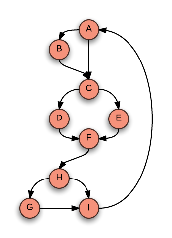

Using `radon` to measure Cyclomatic Complexity
----------------------------------------------

Below is a very simple Python program and it's Cyclomatic Complexity represented
as a acyclic directed graph:

Python Program:

```py
print('A')

if True:
    print('B')

print('C')

if True:
    print('D')
else:
    print('E')

print ('F')

if True:
    if True:
        print('G')
    print('H')

print('I')
```

Graph:



This program gets a Cyclomatic Complexity score of "5":

```sh
$ radon cc -s example.py
example.py
    F 1:0 cyclo23 - D (23)
    F 19:0 cyclo9 - B (9)
    F 68:0 cyclo5 - A (5)     <-- program from above
    F 47:0 cyclo3 - A (3)
    F 37:0 cyclo2 - A (2)
``
